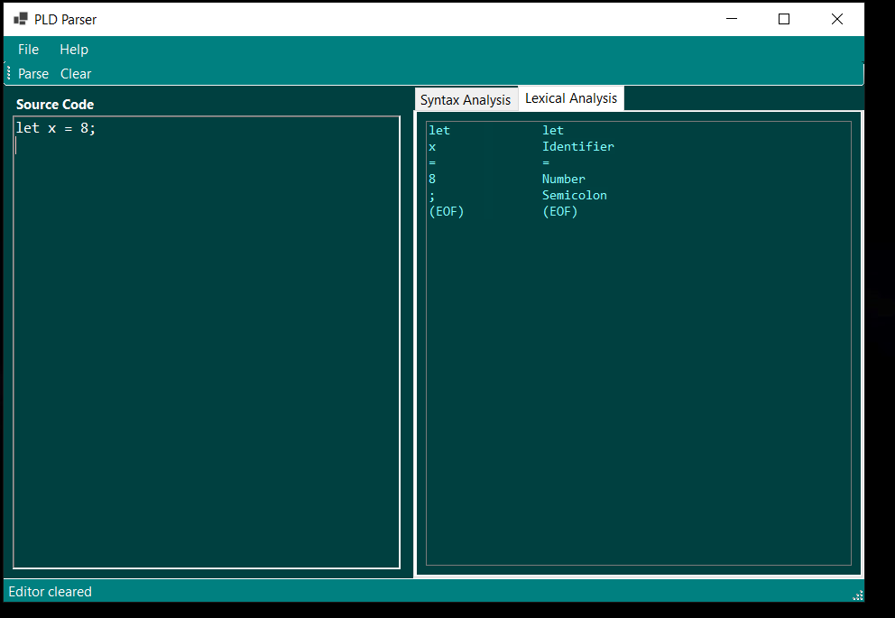

# Screenshots 


### Lexical Analysis


### Syntax Analysis


### Open file


### Choose file


### parse file


## About Zlang Syntax

Zlang features a Python-like syntax . It supports variable assignment, conditional statements, loops, and print statements.

### Simple Example:

```python
# Variable assignment
let x = 10;
let y = 20;

# Arithmetic operations
let sum = x + y;

# Print statement
print sum;

```